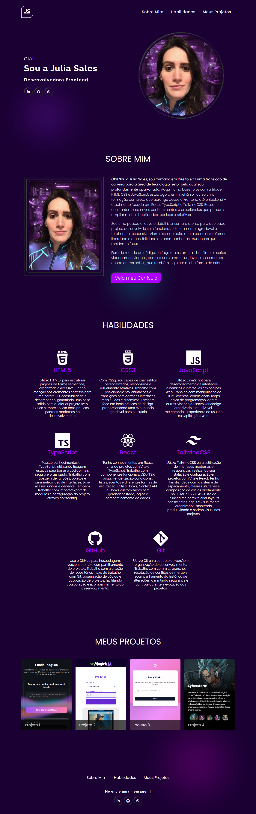

# 🗃 Portfólio - Julia Sales

Este repositório contém meu portfólio pessoal, desenvolvido com foco em apresentar de forma clara minhas habilidades, projetos e trajetória profissional.

---

## 📖 Sobre o projeto
O portfólio foi construído utilizando **HTML** e **CSS**, com design **responsivo** para garantir boa experiência em diferentes dispositivos.  

Ele reúne em uma única página:
- **Resumo sobre mim**  
- **Minhas principais habilidades**  
- **Projetos desenvolvidos** (com diferentes tecnologias)  
- **Links de contato** e redirecionamento para redes sociais e currículo  

O objetivo é servir como **vitrine profissional**, centralizando minhas experiências e trabalhos de forma organizada.

---

### Screenshot

### Links

- Solução no Repositório: [Acesse o repositório do meu Portfólio aqui](https://github.com/jsales25/new-portfolio.git)
- Live Site: [Acesse o meu Portfólio aqui](https://jsales25.github.io/new-portfolio/)

---

## 🛠️ Tecnologias utilizadas
- **HTML5**  
- **CSS3**  

Projetos destacados dentro do portfólio incluem também:
- **JavaScript**  
- **Automação com N8N**  
- **Integração com APIs**  
- **Integrações com Inteligência Artificial**  

---
## 📫 Contato 

**Julia Sales**

- **GitHub:** [Acesse o GitHub da Julia Sales aqui](https://github.com/jsales25)
- **Frontend Mentor:** [Acesse o Frontend Mentor da Julia Sales aqui](https://www.frontendmentor.io/profile/jsales25)
- **LinkedIn:** [Acesse o LinkedIn da Julia Sales aqui](https://www.linkedin.com/in/julia-sales-developer/)

---

  Feito com 💜 por Julia Sales

